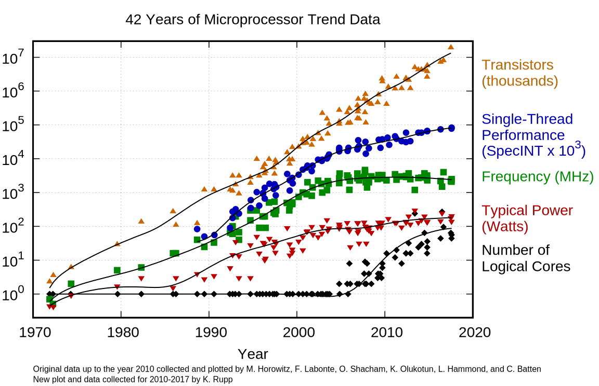

## What is Parallel Computing?

Parallel computing is a programming method that harnesses the power of multiple processors at once.  Once of concern only to programmers of large supercomputers, modern computers now almost always have multi-core processors.

Typical programming assumes that computers execute one operation at a time in the sequence specified by your program code.  At any time step, the computer's Central Processing Unit (CPU) core will be working on one particular operation from the sequence.  We will call this traditional style of computing *sequential*.

In contrast, with *parallel* computing we will now be dealing with multiple CPU cores that each are independently working on a sequence of instructions.  This can allow us to do much more at once, and therefore get results more quickly than if only running an equivalent sequential program.  The act of changing sequential code to parallel code is called *parallelization*.

Even when coming to the world's largest supercomputer, running existing sequential code will not show a big difference in performance.  Today's fast computers are defined by the number of CPU cores, not by individual CPU core speed.  When you run code on a larger server then you need to ensure that you are effectively using the multiple cores that are available.

## Why use Parallel Computing?

Parallel computing, even on a smaller scale, has become more popular over the last decade.  Before this time, the speed of CPUs was continually increasing.  The solution to a computer running too slowly was often to purchase a newer, faster computer.

This continual increase in computer performance is often termed Moore's Law.  Moore was a cofounder of Intel and starting in the 1960s he predicted that the performance of computer processors would double every 18 months. This was indeed true for many decades.

The increasing capability in computer processors drove ever faster processors.  However, faster processors are no longer feasible since manufacturers have come up against the physical limitations of CPU manufacturing.  Instead, chip manufacturers have refocused on multi-core chips.  Instead of trying to create faster processor cores, they are making more cores in one physical processor chip.  The laptop or desktop you are working on now probably has around 4 cores in it.  The servers we use in Carleton's Research and Development Cloud can have up to 32 cores.  And even more cores exist elsewhere on clusters, where programs are written that span multiple computers across a local network.

*Image courtesy of [Karl Rupp](https://www.karlrupp.net/2018/02/42-years-of-microprocessor-trend-data/)*
{: .text-center }

However, certain problems cannot be solved in parallel.  Also, parallelizing code requires some extra programming effort. In this workshop, we will talk about the conceptual differences between sequential and parallel programming, discuss when to expect performance improvements from converting to parallel code, and as an example apply these concepts to MATLAB code.

## Using cores: Parallel vs Sequential Batch

When we talk about parallel programming, we mean writing a single code that simultaneously uses multiple processing cores.

In fact, there is another way to make efficient use of many processor cores.  If your code can run as many smaller, separate programs then you could run multiple programs at once to make use of the CPU cores.  If you have many of these small jobs to run, then they could all be queued up in the background and automatically run as previous jobs finish.

For example, if you are processing a large number of data files, say large volumes of sensor data, it may be possible to run each data file in an independent program.  Monte Carlo methods, which involve many repeated and independent random samples, could also be broken apart into separate programs.  Or perhaps you want to run a simulation many times across a range of parameters.

Running this kind of sequential batch processing does not require any specialized programming, and just a few tricks on a Linux server to setup effectively.  It is not in the scope of the proceeding lessons, but if it sounds applicable to your work I would encourage you to investigate this technique.
