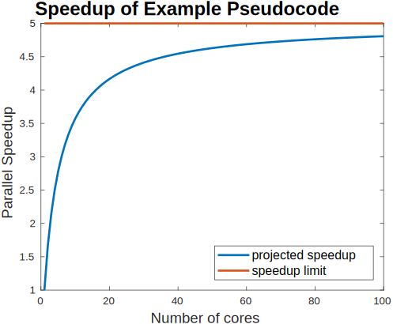

## What is parallel speedup?

How much faster could your program's code be if you convert it to parallel?

One good way to measure a parallel programs performance is speedup.  If your sequential program on `1` core takes `T(1)` seconds to run, and your parallel program on `p` processors takes `T(p)` seconds, then *speedup* can be defined as `S(p) = T(1)/T(p)`.

How fast this actually is depends on how many processors you are using.  For example, let's assume you are using 4 cores on a laptop.  Say you take a long running program and break it up into 4 equal pieces, one for each core.  Then you could assume it would be 4 times faster on your quad-core computer.

Indeed, this is generally the best case scenario.  In general, the ideal speedup, called *linear speedup*, can be defined as `S(p) = p`.

There are, in fact, rare times when you might see *superlinear speedup*.  There are limited amounts of faster memory associated with each processor called cache. Using multiple processors can mean a larger total amount of this faster memory, and perhaps the parallel program can use it more effectively than the smaller amount available to a sequential program.  However, such hardware-specific exceptions are rare.

## Amdahl's Law

Linear speedup is only a best case scenario.  You can rarely parallelize all the code in your program.  There will be some code that must remain sequential.

In subsequent sections, we'll delve into hardware specific details on what can cause your parallel code have less than linear speedup.  For now, let's look at a high-level outline of a program to think more about the limits to parallel speedup.

| Code Section | Sequential Time | Description |
| --- | --- | --- |
| Section 1 | 4 minutes | Initialize |
| Section 2 | 5 minutes | Read input files |
| Section 3 | 60 minutes | Compute results |
| Section 4 | 5 minutes | Output results to file |
| Section 5 | 1 minutes | Cleanup variables |

Let's say in this program that you are only able to parallelize section 3.  How fast could this program possibly go?

We can calculate `T(1) = 4+5+60+5+1 = 75`.  A formula to compute the time in parallel would be `T(p) = 15 + 60/p` since the 60 minutes for section 3 will run in parallel over `p` processors, while the remaining 15 minutes only runs on one processor.

Using this equation, here is what happens to speedup as you increase the number of processor cores

So on 2 processors, the parallel program should take 45 minutes.  On 10 processors, 21 minutes.  If it were possible to keep on going, on one thousand processors, 15 minutes.  On one million processors, still around 15 minutes.

As this graph demonstrates, there are only so many processors that would be worth assigning to a particular program, as there are diminishing returns with larger numbers of processors.

In fact, since speedup is a ratio of the sequential to parallel runtimes, the specific running time doesn't matter when expressing this concept.  This leads us to *Amdahl's Law*: if `k` is the fraction of a sequential code's running time that can be parallelized, then `S(p) = 1/(1-k + k/p)`.

We can see the effect of varying values of `k` in the following graph.  Even a small section of sequential code imposes a practical limit in parallel programs.

