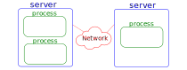

If a program is going to use multiple processor cores, then it needs to simultaneously do more than one "thing" at once.  There are two types of these "things", or what we may informally call workers - processes and threads.   In both cases, the computer's operating system is responsible for scheduling workers onto your hardware's processor cores.

There also are two industry standards for parallel programming - OpenMP and MPI.  These are the most common techniques for implementing high-performance computing code.  We will briefly describe the differences between these programming interfaces to illustrate the differences between processes and threads for parallel computing.

## Processes

A running instance of a software program is a *process*.  Each process has its own resources, such as memory space, open files, etc.  This means data (e.g. variables) visible in one process are isolated from other processes.

A particular software program can run more than once, which produces multiple processes. In fact, parallel programming often happens by running multiple, coordinated processes.

However, recall that processes cannot directly access each others' data.  At times parallel workers may need to share data, and so there are techniques to communicate by sending and receiving data between each other.  These *messages* can even be sent over a network, allowing a parallel program's processes to span multiple computers.  The largest supercomputers are in fact large collections of servers used in this way.

The *Message Passing Interface*, or MPI, is a library for C, C++, Fortran, and unofficially other languages.  Using this library programmers are able to start a parallel program that contains multiple processes, and send/receive messages between processes to coordinate and share data.  Because messages can be passed over a network, MPI can run across multiple computers.

## Threads

A *process* can contain multiple *threads* of execution.  These threads all share access to the process' data, and so it can be easier and faster to use threads for parallel programming.  However, since the threads are all contained in a single process, they are all on the same computer.

The *OpenMP* programming interface extends C, C++, and Fortran with commands to perform multi-threaded shared memory parallel programming.  It is often easier to modify a program to use OpenMP compared to MPI, but an OpenMP program is limited to a single computer.

