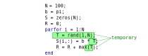
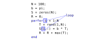
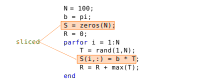
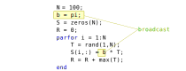
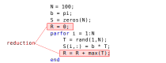

Some of these topics may go in a later section.  But I wanted to capture them somewhere for now:

  - Parallel in Matlab
  - Using `tic`/`toc` commands
  - Tutorial on Matlab profiler should be somewhere
  - Automatic multicore: Vectorization
      - Example that does well
      - Example that doesn't do as well *(can I find one?)*
  - Introduce *parfor* command
  - Discuss -singleCompThread
      - Mention how it cann affect speedup calculation (e.g. might not really be comparing sequential against parallel)
  - Categories Variable classification in parfor
  - Random Number Generation in parfor
  - lots of printing to command window can be slow

## Overview

We have discussed in abstract the principles behind using parallel programming to improve code performance.  Now let us turn to more concrete examples using Matlab.

## Starting Parallel Matlab

When Matlab runs parallel code, it needs a parallel pool.  Your main Matlab code starts up a set of workers, that will work simultaneously on any parallel sections in your code.  The main Matlab code assigns work to each of the works, and gathers the results after the parallel section is complete.

With its default settings, Matlab will automatically start a parallel pool as needed.  However, it can be explicitly start the parallel pool yourself.  In particular, it allows you to specify how many processor cores you want to use.

For example, to use the 4 cores on a quad-core laptop;

~~~
parpool(4);
~~~
{: .source }

This can be particularly useful on a shared server, where you do not want to use all of the cores.  You can set a specific number with the parpool command.

In general to ensure you use all processor cores, even on a large server, I would recommend putting these lines at the start of your parallel Matlab code:

~~~
if isempty(gcp('nocreate'))
    parpool(feature('numcores'));
end
~~~
{: .source }

The gcp (Get Current Pool) command, when passed nocreate, will return a description of the current parallel pool.  If none has started yet, it returns nothing, i.e. an empty value.  So if no parallel pool exists yet, this code will run the parpool command to initialize a pool.  It is passed in the number of processor cores that exist on your computer.

## Parallel Loops

Matlab has a `parfor` command that works like the usual `for` loop, except the loop runs in parallel.  The main 

Let us look at an example:

~~~
S = zeros(numHands, numPlayers);
for i = 1:numPlayers
   S(:, i) = pctdemo_task_blackjack(numHands, i);
end
~~~
{: .source }

This loop executes the function `pctdemo_task_blackjack`.  It does this `N` times;  we call each time a loop iteration.  To run this in parallel we need to change the `for` to a `parfor`:

~~~
S = zeros(numHands, numPlayers);
parfor i = 1:numPlayers
   S(:, i) = pctdemo_task_blackjack(numHands, i);
end
~~~
{: .source }

In this case, the conversion to parfor was easy.  However, there are more details to look at to be able to successfully use parallel loops.

## Loop Independence

The above code works because each loop iteration is independent.  This means that values calculated in a previous iteration are not required in future iterations.  This independence is necessary otherwise only one iteration could run at a time, with others waiting on results.  So loops either must be independent, or you must be able to make them so in order to use parallel for loops.

For example, this loop would not work in parallel.  In particular the value of z(i-1) is used in the loop calculate the value of z(i):
~~~
v = rand(1,1000);
z = zeros(1,1000)
z(1) = 0;
for i = 2:1000
    if v(i) > z(i-1)
        z(i) = v(i);
    else
        z(i) = 0;
    end
end
~~~
{: .source}

For reference, see [https://www.mathworks.com/help/distcomp/ensure-that-parfor-loop-iterations-are-independent.html](https://www.mathworks.com/help/distcomp/ensure-that-parfor-loop-iterations-are-independent.html)

## Variable Classification

Matlab classifies all variables used in a parallel for loop into categories.  Let's take a look at the different kinds of classifications.  We will use the example [code/classification.m](../code/classification.m)

For reference, see [https://www.mathworks.com/help/distcomp/troubleshoot-variables-in-parfor-loops.html](https://www.mathworks.com/help/distcomp/troubleshoot-variables-in-parfor-loops.html)

### Temporary Variables

Temporary variables are private to a loop iteration and will not be used outside the parallel loop, or in any other loop iteration.  Matlab determines that a variable inside a parfor is temporary if it is initialized to a value inside the loop.

In the above code example, the variable ~T~ is set to an 1XN vectir.  Note that the entire variable is being assigned a vector.  To be considered a temporary variable, it is not enough to set just some elements in the array, for example this is *not* sufficient: `INCORRECT(i,:) = zeros(1,N);`

Other loop variables are used in some way before and after the loop.  They all must be initialized before the loop starts to differentiate them from temporary variables.

### Loop Variables

The loop variable (such as `i` in the example here) must be a consecutive range of integers.  You may convert a loop with a different sequence of loop values by performing a calculation in the loop, or looking up the required values in a precomputed vector.

### Sliced Variables

Sliced variables are vectors (or matrices) that are sized to have an element (or row/column) for each loop iteration.  Each loop iteration can write to only its element, indexed by the loop variable.  For example, `S` is a sliced variable in this parallel loop:

The indexing into a sliced variable must be kept simple, so that Matlab can be assured that each loop iteration is indeed writing values to distinct locations.  Matlab gives each worker just its slice of the variable, so that the entire variable does not need to be shared, which saves some time and memory.

### Broadcast Variables

A broadcast variable is simply a variable that is read-only inside the loop.  That is, values from the variable are used in the parallel loop, but the variable is never updated inside the loop.  A copy of the entire variable is sent to every worker, which why it is termed a broadcast variable.

In this code example, `B` is a broadcast variable.

### Reduction Variables

A reduction variable is a useful way to get a summary value from a parallel loop.  It is the result of some operation that combines values in each loop iteration.  It is a variable that is shared between loop iteration.  However, the operation that updates the variable should be associated.  That is, the order in which the variable is updated shouldn't affect the result, since parallel loop iterations do not complete in a deterministic order.

For example, `R` is a reduction variable in this example:

As mentioned, reduction variables will not work correctly with non-associative operations.  For example, division will not always result in the right answer:

~~~
B = [ 2 3 4 ];
result = 120;
for i = 1:3
    result = result / B(i);
end
fprintf('for result: %d\n', result);

result = 120;
parfor i = 1:3
    result = result / B(i);
end
fprintf('parfor result: %d\n', result);
~~~
{: .source }
~~~
for result: 5
parfor result: 180
~~~
{: .output }

## Transparency

Since Matlab needs to be able to inspect the variables in a parfor loop before running it, there are restrictions on what commands can be used inside the parallel loop.  These restrictions are called parallel transparency.  In particular, commands like `save`/`load`, `clear`, and `eval` cannot be used.  These commands modify Matlab's workspace variables without necessarily being obvious about what variables may be changing.

One useful workaround is to put some of the parallel loop's code in a function.  Code inside a function does not need to be transparent. A Matlab function has its own variable workspace, so it does not affect the shared parallel workspace used in the parallel loop iterations.

For reference, see [https://www.mathworks.com/help/distcomp/transparency.html](https://www.mathworks.com/help/distcomp/transparency.html)

## Timing Matlab code

We have mentioned that a very important point is to figure out which part of your code takes a long time.  Matlab provides the `tic` and `toc` commands to do this.  You just need to put a `tic` command where you want to start timing, and a `toc` command where you want to stop timing.  The `toc` command will print out how long the code between these commands took.  For example:

~~~
tic
n = 200;
A = 500;
a = zeros(1,n);
for i = 1:n
    a(i) = max(abs(eig(rand(A))));
end
toc
~~~
{: .source}
~~~
Elapsed time is 18.636459 seconds.
~~~
{: .output }

It is also useful to note that printing a large number of messages to the command window can slow down your program.  So when doing code timings, make sure to add semicolons to most lines and not too many command window output commands such as `fprintf` or `display`.

Another way to find the slow parts in your code is the Matlab profiler. Details on using the Matlab profiler may be found at [https://www.mathworks.com/help/matlab/matlab_prog/profiling-for-improving-performance.html](https://www.mathworks.com/help/matlab/matlab_prog/profiling-for-improving-performance.html)

## Parallel Random Number Generation

Random number generators create numbers from a particular sequence.  When running it parallel, it would be difficult and slow to share one random number sequence among workers.  Instead, Matlab automatically sets up a distinct random number sequence for each worker.

Most of the time, this is exactly what you need.  However, if you are testing your code and want to see that the parallel version still gives correct results, then it is important to fix the random number sequence to a specific random seed.

To do this in parallel Matlab:

~~~
SEED = 100;
parfor ii = 1:N
    s = RandStream('CombRecursive', 'Seed', SEED);
    RandStream.setGlobalStream(s);
    s.Substream = ii;
    
    fprintf(' ii=%d: %f %f %f\n', ii, randn(3,1));
end
~~~
{: .source }
