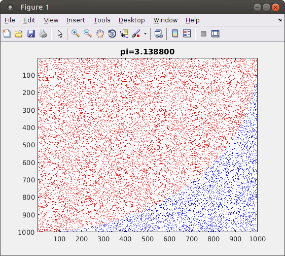
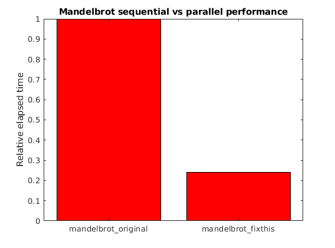

## Example MATLAB parfor

### Monte Carlo Illustration

It is easier to learn how to program by working through real examples.

Let us look at a typical example of a Monte Carlo process - computing the value of PI.

First, to understand what this example does, let's run [code/montecarlo/montecarlo_illustration.m](../code/montecarlo/montecarlo_illustration.m).  This code shows a quarter of a circle.  Random points are selected, and determined to be inside or outside the circle.  The ratio of points in the circle is proportional to PI, so as the random selection of points grows, we can approximate the value of PI.

### Monte Carlo Parallel

The montecarlo_illustration.m code only shows a few points.  Let's now move on to [code/montecarlo/montecarlo.m](../code/montecarlo/montecarlo.m).  This code is similar, except it generates many more points, and for performance it no longer displays a visual image.

How could we improve the performance of this code?

The code is primarily comprised of one big loop.  Can it be parallelized?  We only have one loop to choose  parfor. Each iteration of the loop has its own temporary x,y values.  The only shared variable is `incircle`, which satisfies classification as a reduction variable, and the loop variable correctly counts the integers.  So each iteration of the loop is in indeed independent.  The code even has tic/toc commands already, so we are all set to convert this to a parallel loop.

Go ahead and rename the `for` statement to a `parfor` statement.  Now let's see whether it goes any faster.  But first, start a MATLAB parallel pool.  You may do so using the parpool command you saw previously, or using MATLAB's parallel pool menu in the bottom left corner.  MATLAB is usually setup to automatically start a parallel pool when needed.  However, our PI calculation doesn't take too long unlike a full-scale problem where the parallel pool startup time would not be significant.  So let's avoid skewing the timing results in our small example by counting the time to start the parallel pool.

Once the pool is started, run your parallel code.  What speedup did you obtain?

## Limits of parfor

It is important to reiterate that not all MATLAB `for` loops can be converted to `parfor`.

For example, the prefix sum problem computes the sums of elements up to a particular location in a vector, for every location in the vector.  In MATLAB this is called the `cumsum` function.  Our own code to compute this might look like:

~~~
n = 20
V = randi(2,1,n)-1;
prefix = zeros(n)

V
for ii = 2:n
    V(ii) = V(ii) + V(ii-1);
end
V
~~~
{: .source}

There is an dependency for the current prefix sum element on the previous one.  This stops us from being able to use a parfor.  When working on your own projects, it is worthwhile to remember that not all MATLAB loops can be parallelized.

## Parallel MATLAB performance

Here is another example of a parallel loop.  This loop obtains appreciable speedup:
~~~
n = 200;
A = 500;
a = zeros(n);
parfor i = 1:n
    a(i) = max(abs(eig(rand(A))));
end
~~~
{: .source }

On the other hand, this is a valid `parfor` loop that does not run faster than a regular `for` loop":
~~~
n = 1024;
A = zeros(n);
parfor (i = 1:n)
    A(i,:) = (1:n) .* sin(i*2*pi/1024);
end
~~~
{: .source }

The first loop performs a longer computation within each loop iteration, and only returns a single value from the workers back to the main MATLAB process.  On the other hand, the second loop take a relatively long time when sharing more data with the workers.  This is an example of how communication overhead can adversely affect performance of parallel code.

For reference: [https://www.mathworks.com/help/distcomp/decide-when-to-use-parfor.html](https://www.mathworks.com/help/distcomp/decide-when-to-use-parfor.html)

## Fixing code for MATLAB parfor

Let's look at code that computes and then draws the Mandelbrot set. The Mandelbrot set is an example of a fractal, where a rough-edged geometric pattern repeats indefinitely as you zoom in.  It is fun to look at, so it makes a good example.

The code is available at [code/mandelbrot/mandelbrot_fixthis.m](../code/mandelbrot/mandelbrot_fixthis.m).  If you try running this now, you will see that it takes a while to compute all the points in a particular zoomed image on the Mandelbrot set.  The set is then displayed, along with the time to compute.  This code can be parallelized with a parfor, but a few fixes will need to be made.  Can you figure out how to make a `parfor` version of mandelbrot.m?

This example is based on code from [the Mathworks website](https://www.mathworks.com/help/distcomp/examples/illustrating-three-approaches-to-gpu-computing-the-mandelbrot-set.html)

