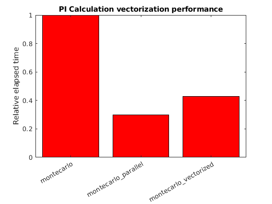

## What is Vectorization?

Another technique for improving Matlab code performance is vectorization.  This is a large subject, and we will only scratch the surface in this lesson.

Many operators and functions in Matlab can be applied to an entire matrix.  This can replace loops that apply the operations to each matrix element individually.  The resulting vectorized code can be more compact, making it easier to read.  Also it is usually fast because Mathworks implements highly optimized vectorized operations.  In fact, Matlab will implicitly run some vectorized operations in parallel to use more than one CPU core without the need for an explicit `parfor` statement.

The way that Matlab creates parallel workers for vectorized matrix operations is different than how `parfor` works.  The vectorized parallel workers are threaded, which allows workers to share data in variables without making copies of it.

On the other hand, vectorizing code is limited to operations that can be performed on a matrix instead of individual elements in a for loop.  It can be difficult to use this approach with complex loops that often do not lend themselves to vectorization.

Let us take the following code as an example:

~~~
~~~
{: .source }

A vector

## Memory use

Let's now look at an example of vectorized code.  The monte carlo method to calculate PI can be vectorized, as shown in this example: [code/montecarlo/solution/montecarlo_vectorized.m](../code/montecarlo/solution/montecarlo_vectorized.m)

~~~
N = 2E8;
x = rand(1,N);
y = rand(1,N);
incircle = sum(sqrt(x.^2 + y.^2)<1.0);
mypi = 4*(incircle/N);
~~~
{: .source}

## Disable Parallel Vectorization

Many of Matlab's vectorized operations automatically make use of parallel processing for large matrices.  This can make efficient use of all cores, in which case you don't need to do any more work to use multiple processor cores.

However, in a few cases vectorization will use multiple cores without gaining much speedup.  You can test how fast your code runs on only one core by starting Matlab using the the *-singleCompThread* option. It may be interesting to compare your Matlab code with a single computational core to the default with multiple cores to determine speedup from this feature.

From a Windows Command Prompt or a Linux terminal, you may run the command ~matlab -singleCompThread~ to use Matlab without multithreaded vectorized operations.  From a Mac you need to open a terminal, and run Matlab using the full folder path to Matlab, for example ~/Applications/MATLAB_R2017a.app/bin/matlab -singleCompThread~.

