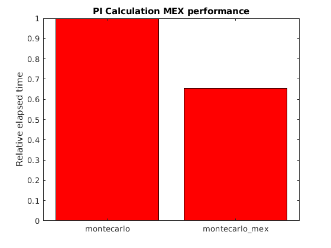

## Overview

Emphasis in this workshop is on parallel computing.  Parallelism is great for fully utilizing hardware - it is how you can speed up already "tuned" code to go beyond what you can do on your laptop.  The point of parallel computing is to improve your code's performance.  Because clock speed is not going up (i.e. CPU cores are not getting faster), we need to make efficient use of multicore hardware to achieve performance gains.

However, it is also worth mentioned the different methods used to tune code before parallelism must be used.  Mathworks in fact recommends a few different techniques to improve MATLAB code performance.  These techniques are preallocation, vectorization, parallelization, and loop constants.

## Preallocation

In MATLAB, variables do not have to be declared.  If you are saving into a matrix into a row or column that doesn't yet exist, then MATLAB will grow the size of the Matrix.  Under the hood, MATLAB actually has to create a new matrix in RAM and copy the data across from the old, smaller memory area.  So if, for example, you do this repeatedly in a loop :

~~~
clear;
N = 3E5;
tic;
for i = 1:N
    A(i,:) = rand(1,4);
end
fprintf('Time without preallocation: %f seconds\n', toc);
~~~
{: .source}
~~~
Time without preallocation: 27.711114 seconds
~~~
{: .output }

~~~
clear;
N = 3E5;
tic;
A = zeros(N, 4);
for i = 1:N
    A(i,:) = rand(1,4);
end
fprintf('Time with preallocation: %f seconds\n', toc);
~~~
{: .source}
~~~
Time with preallocation: 0.193926 seconds
~~~
{: .output }

For reference, see [https://www.mathworks.com/help/matlab/matlab_prog/preallocating-arrays.html](https://www.mathworks.com/help/matlab/matlab_prog/preallocating-arrays.html)

## Loop Constants

The idea with this optimization is simple.  If you are computing the same value for a variable every time through a loop, then you are repeatedly calculating the same thing.  Instead, if you can just calculate the value once outside the loop, then you will save some time.

~~~
tic;
for ii = 1:100
    A = eig(magic(2000))
    % Let's pretend there is more code here...
end
toc;
~~~
{: .source }
~~~
Elapsed time is 43.479244 seconds.
~~~
{: .output }

~~~
tic;
A = eig(magic(2000))
for ii = 1:100
    % Let's pretend there is more code here...
end
toc;
~~~
{: .source }
~~~
Elapsed time is 2.116375 seconds
~~~
{: .output }

## Vectorization

As previously discussed, vectorized operations perform computation on each element in a matrix.  For example, the `.*` element-wise operator will multiply each element of an array with the matching element.  Using vectorization where possible can help to speed up your code.

For reference, see [https://www.mathworks.com/help/matlab/matlab_prog/vectorization.html](https://www.mathworks.com/help/matlab/matlab_prog/vectorization.html)

## Parallelization

As we have seen with parfor, MATLAB has commands that allow you to explicitly break apart work into separate pieces to run at once.  MATLAB has other advanced parallel programming constructions.  For example, parfeval calls a function in parallel across multiple inputs.  The spmd command runs one task for each worker processor and can even exchange data between tasks.  These additional MATLAB parallelization techniques are out of scope of this workshop and will not be discussed in detail.

## MATLAB MEX Compilation

The MATLAB Coder is able to convert MATLAB code from `.m` files to `.mex`.  The `.mex` file is a compiled version that has the potential to run faster than the original MATLAB source.

There are some restrictions when using MATLAB Coder.  The MATLAB `.m` must be a function file, there are certain functions and toolboxes that cannot be used, you must specify data types and usually also fixed sizes for all arguments passed to your MATLAB function, and the resulting `.mex` file targets the specific computer and operating system on which it was created.

Let us return to the PI calculation code [code/montecarlo/mexexample/montecarlo.m](../code/montecarlo/mexexample/montecarlo.m).  The easiest way to compile this code to a MEX file is using the graphical MATLAB Coder app, which will walk you through the process of creating a MEX file.  The other way is using the MATLAB `codegen` command.  The `codegen` command is simple in this case, since our montecarlo function does not have any inputs or outputs:

~~~
codegen montecarlo
~~~
{: .source }

And when comparing the performance of the original montecarlo to the montecarlo_mex, we obtain this speedup:

