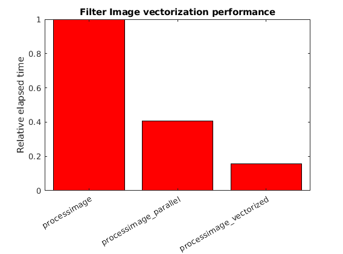

## What is Vectorization?

Another technique for improving MATLAB code performance is vectorization.  This is a large subject, and we will only scratch the surface in this lesson.

Many operators and functions in MATLAB can be applied to an entire matrix.  This can replace loops that apply the operations to each matrix element individually.  The resulting vectorized code can be more compact, making it easier to read.  Also it is usually fast because Mathworks implements highly optimized vectorized operations.  In fact, MATLAB will implicitly run some vectorized operations in parallel to use more than one CPU core without the need for an explicit `parfor` statement.

The way that MATLAB creates parallel workers for vectorized matrix operations is different than how `parfor` works.  The vectorized parallel workers are threaded, which allows workers to share data in variables without making copies of it.

On the other hand, vectorizing code is limited to operations that can be performed on a matrix instead of individual elements in a for loop.  It can be difficult to use this approach with complex loops that often do not lend themselves to vectorization.  It also requires temporary data to be stored in large matrices, rather than being generated inside a loop and immediately thrown away.  This can affect memory requirements and potentially performance as well.

Let's look at a typical example of code that can benefit from vectorization.  We will do a simple image processing task on a large image taken from NASA of the Orion Nebula, taken by the Hubble space telescope.  We'll do a simple greyscale conversion, except light grey and white will be converted to shades of yellow.  You can see the original and filtered images here: 

The original code to perform this filtering is in [code/imagefilter/processimage.m](../code/imagefilter/processimage.m).  An image is stored as a 3D matrix - the first two dimensions are just the X and Y coordinates of the grid of pixels in the image.  The third dimension are three layers of red, green, and blue channels.  This original code has for loops to handle each pixel one at a time.  Inside the for loops, there is also an if statement to conditionally handle the yellow highlights.

The vectorized version of the code in [code/imagefilter/processimage_vectorized.m](../code/imagefilter/processimage_vectorized.m) produces the same result.  However, there are no for loops or if statements.  Matrices are directly operated on as a whole.  This code is more efficient, and after you get used to this style of programming it can look quite elegant as well.

For comparison, there is a version of the original for loop code using a parfor in [code/imagefilter/processimage_parallel.m](../code/imagefilter/processimage_parallel.m).  However, as can be seen the following speedup graph, the vectorized version outperforms both the original and parallel versions of this image filtering example:

## Memory use

Let's now look at an example where `parfor` parallelization runs more quickly than vectorized code.  We will return to the monte carlo method to calculate PI, as illustrated with this figure:

Vectorized code to perform this calculation is shown in this example: [code/montecarlo/solution/montecarlo_vectorized.m](../code/montecarlo/solution/montecarlo_vectorized.m)

~~~
N = 2E8;
x = rand(1,N);
y = rand(1,N);
incircle = sum(sqrt(x.^2 + y.^2)<1.0);
mypi = 4*(incircle/N);
~~~
{: .source}

The drawback with this approach is that all the `N` random points must be generated and stored in RAM before the calculation begins.  This requires more memory and will not be feasible for large `N`.  It also slows down the calculation, since the CPU processor must wait for data to be read from RAM, rather than generating the random points and immediately using them without storing them to RAM.  When we look at the speedup graph for this PI calculation, we see that while the vectorized code does run more quickly than the original, it is not as fast as the `parfor` version:

## Disable Parallel Vectorization

Many of MATLAB's vectorized operations automatically make use of parallel processing for large matrices.  This can make efficient use of all cores, in which case you don't need to do any more work to use multiple processor cores.

However, in a few cases vectorization will use multiple cores without gaining much speedup.  Or even if you do gain performance from parallel vectorized computation, you might be interested to see how much performance comes from using multiple cores.  You can test how fast your code runs on only one core by starting MATLAB using the the *-singleCompThread* option.

You could compare your MATLAB code with a single computational core to the default with multiple cores to determine speedup from this feature.  And inside a `parfor` loop, vectorized operations will not be in turn parallelized.  So this will affect speedup you see if you parallelize a loop containing computationally intensive vector operations.

From a Windows Command Prompt or a Linux terminal, you may run the command `matlab -singleCompThread` to use MATLAB without multithreaded vectorized operations.  From a Mac you need to open a terminal, and run MATLAB using the full folder path to MATLAB, which varies on the particular version. For example on my Macbook I would disable parallel vector operations by starting MATLAB using `/Applications/MATLAB_R2017a.app/bin/matlab -singleCompThread`.

